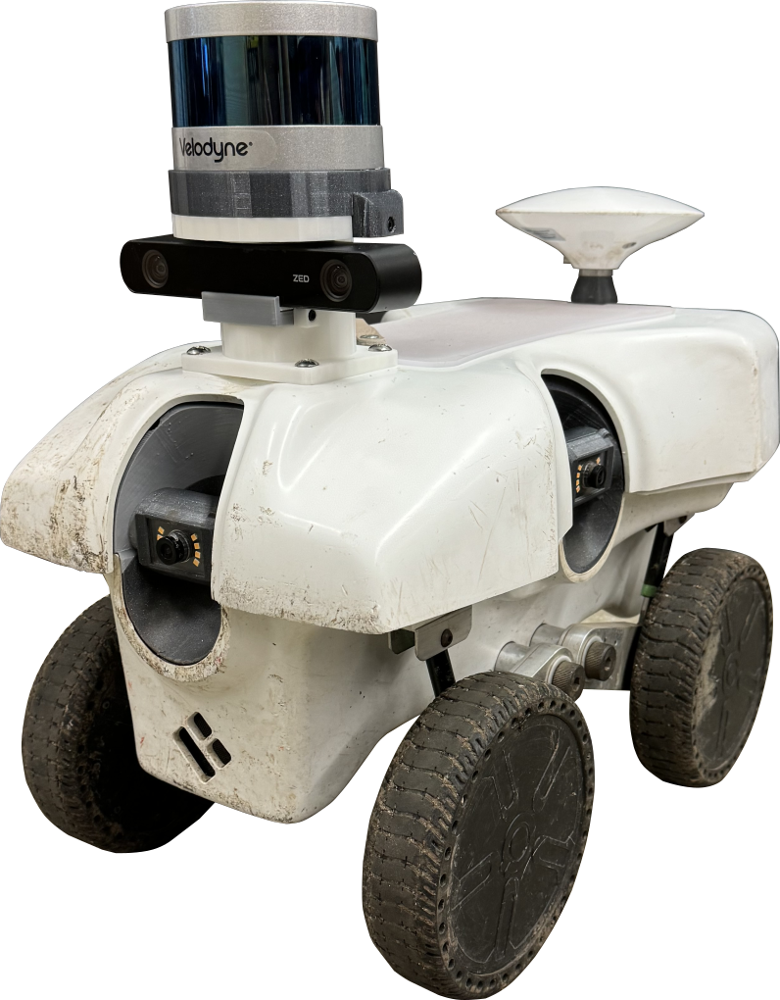

# TerraSentia navigation package
A package with everything you need to run traversability algorithms on TerraSentia robots

## Setup

This repository is created to run on a custom modification of the TerraSentia robot.
<p align="center">
    
</p>

Our TerraSentia mod, referred as TerraSentia*, contains a Velodyne Puck VLP-16 LiDAR and three fixed RGB cameras.

### Time synchronization in multiple devices
To ensure the IMU messages are synchronized with the other messages, install chrony in the Raspberry Pi device (192.168.1.135):
```
sudo apt-get install chrony
```
Choose one machine as time server (usually the Jetson 192.168.1.99).
On this machine, do:
```
sudo vim /etc/chrony/chrony.conf
```
Add these lines:
```
# make it serve time even if it is not synced (as it can't reach out)
local stratum 8
# allow the IP of your peer to connect
allow 192.168.1.135
```
Then, on the client (`192.168.1.133`):
```
sudo vim /etc/chrony/chrony.conf
```
Add this lines:
```
server 192.168.1.99 minpoll 0 maxpoll 5 maxdelay .05

## To use DLIO as the state estimator

Clone the DLIO package (our fork):
```shell
git clone git@github.com:matval/direct_lidar_inertial_odometry.git
```
### Run the navigation package
- Make sure the package is compiled. In your ROS workspace, run:
```shell
catkin make
```
Then, run the navigation launch
```shell
roslaunch terrasentia_navigation terrasentia_navigation.launch
```